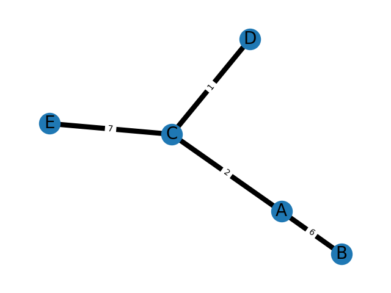

# How to Implement Multi-Key Maps

## Motivation

We might run into a case when we need a multi-key map. Let say we need to store all edge weights of a graph like the one shown in the image below.
In this case, the weight of node A to node C is the same as that of node C to node A, which is 2.
We would like to store those weights in a container and look them up later.

<!--  -->
<!--  -->


## Implementation

The first idea that we might have is to use a hash table since it only requres O(1) for look-ups.
In C++, a hash table is an unordered map.
We might want to use a pair as our key and let the value be the weight between two nodes.


## Challenges

This is a good approach; however, **std::unordered_map** does not support **pair** as keys.
Furthermore, we want pair AC and pair CA to have the same value since both of them represent the same edge and thus have the same weight.


## Solution

The reason why look-ups only take O(1) is because the key was hashed as soon as we insert a new key-value pair to our unordered map.
Hence, we need to implement a hash function that does that task since this is not included in the standard library.

```cpp
struct KeyHash
{
    template <typename T>
    std::size_t operator()(const std::pair<T, T>& p) const noexcept
    {
        // we always hash the smaller element first, then the bigger element
        auto a = std::min(p.first, p.second);
        auto b = std::max(p.first, p.second);
        std::size_t h1 = std::hash<T>{}(a);
        std::size_t h2 = std::hash<T>{}(b);
        return h1 ^ (h2 << 1);
    }
};
```

We always hash the smaller element first, then we hash the bigger element.
It does not have to be this way but there must be a fix order, otherwise the hash value for the keys may be inconsistent.

Now, we need to implement a function that let our unordered map know if two keys are the same.
This is crucial since we want the return value be the same for pair AC and pair CA, as we mentioned before.

```cpp
struct KeyEqual
{
    template <typename T>
    bool operator() (const std::pair<T, T>& lhs, const std::pair<T, T>& rhs) const
    {
        return lhs.first == rhs.first && lhs.second == rhs.second || \
        lhs.second == rhs.first && lhs.first == rhs.second;
    }
};
```

Struct KeyEqual returns true when the first element from pair lhs equals to that from pair rhs and the second element from pair lhs equals to that from pair rhs or
when the first element from pair lhs equals to the second element from pair rhs and the second element from pair lhs equals to the first element from pair rhs.
If that is a bit confusing just remember that it will return true when pair AC and pair AC are presented as well as when pair AC and pair CA are presented.

Now since our unordered map needs to access those two custom structs in order to function perfectly, we need to insert those when we declare our unordered map.

```cpp
std::unordered_map<std::pair<int, int>, int, KeyHash, KeyEqual> m;
```

## Validations

The following is the entire code.


We initialize some values when we declare our map.
We can verify the correctness of our unordered map by calling *m[{'C', 'A'}]* and indeed, it returns 5, which is the weight of node A node C.

```c++
#include <iostream>
#include <unordered_map>    // std::unordered_map
#include <utility>  // std::pair

struct KeyHash
{
    template <typename T>
    std::size_t operator()(const std::pair<T, T>& p) const noexcept
    {
        auto a = std::min(p.first, p.second);
        auto b = std::max(p.first, p.second);
        std::size_t h1 = std::hash<T>{}(a);
        std::size_t h2 = std::hash<T>{}(b);
        return h1 ^ (h2 << 1);
    }
};

struct KeyEqual
{
    template <typename T>
    bool operator() (const std::pair<T, T>& lhs, const std::pair<T, T>& rhs) const
    {
        return lhs.first == rhs.first && lhs.second == rhs.second || \
        lhs.second == rhs.first && lhs.first == rhs.second;
    }
};

int main()
{
    std::unordered_map<std::pair<char, char>, int, KeyHash, KeyEqual> m;

    m[{'A', 'C'}] = 2;
    m[{'A', 'B'}] = 6;
    m[{'E', 'C'}] = 7;
    m[{'D', 'C'}] = 1;

    std::cout << "The weight between node C and node A: " << m[{'C', 'A'}] << std::endl;

    return 0;
}
```

## Summary

One may argue that the code is rather long and demanding, but this is a good way to implement a multi-key map.
And it comes really handy when doing graph problems.

Happy coding 😀

## Acknowledgement

Those are the sources where I learn:
1. Hash: https://en.cppreference.com/w/cpp/utility/hash
1. KeyHash/KeyEqual: https://en.cppreference.com/w/cpp/container/unordered_map/unordered_map
